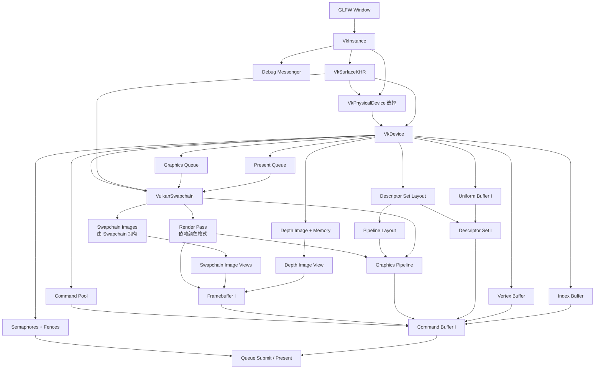

# Vulkan Hello World：代码审阅与渲染器心智模型

> 审阅基线：`RAII_Base` 分支，提交 `2c2eba2`。
>
> 范围：从窗口、Instance、Device、Swapchain、Pipeline、Buffer、Descriptor、Command Buffer、同步、重建到销毁的完整渲染主路径；模型加载器只审阅它与 GPU 资源交接的部分。

## 先说结论

这个 Hello World 已经越过了“只会画三角形”的阶段。它已经具备一个小型渲染器的骨架：模型上传、顶点/索引缓冲、Uniform、Descriptor、深度缓冲、双帧并行、交换链重建，以及两项有效的 RAII 封装。

当前最重要的不是继续堆纹理或材质，而是把下面两个同步正确性问题解决，并把资源按生命周期拆成明确的上下文：

1. `renderFinishedSemaphores[currentFrame]` 不能仅凭帧 Fence 证明已不再被 Present 使用；它应按 `imageIndex` 分配和索引，或者使用可等待的 Present Fence 扩展。
2. 所有 Framebuffer 共用一张深度图；多帧并行时会产生跨 Render Pass 的深度写后写（WAW）冒险。最清晰的解决方案是每个交换链图像一张深度图；也可以保留共享深度图并补齐严格的跨帧依赖，但它不适合作为你的长期渲染器结构。

修完这两项、补上异常路径 RAII 后，就可以放心进入场景遍历与多 Mesh 阶段。

---

## 一、先建立两个索引：`F` 和 `I`

这份代码最关键的心智模型不是某个 Vulkan API，而是两个不同的索引。

| 索引 | 含义 | 范围 | 它回答的问题 |
|---|---|---:|---|
| `F = currentFrame` | CPU 正在复用的帧槽（Frame Slot） | `0 .. kMaxFramesInFlight-1` | “CPU 现在能否再次使用这一套帧同步资源？” |
| `I = imageIndex` | 本次从 Swapchain 获取的图像 | `0 .. swapChain.imageCount()-1` | “这一帧具体渲染到哪张交换链图像及其配套资源？” |

`F` 和 `I` 没有固定对应关系。即使 `F` 按 `0,1,0,1...` 循环，Acquire 返回的 `I` 也可能是 `2,0,1,2...`。

### 当前代码里的资源归属

| 应按 `F` 索引：帧槽资源 | 应按 `I` 索引：图像资源 |
|---|---|
| `inFlightFences[F]` | Swapchain image / image view `I` |
| `imageAvailableSemaphores[F]` | `swapChainFramebuffers[I]` |
| CPU 每帧临时状态 | `commandBuffers[I]` |
|  | `uniformBuffers[I]` |
|  | `descriptorSets[I]` |
|  | `imagesInFlight[I]`（保存占用该图像的 Frame Fence） |
|  | **建议改为** `renderFinishedSemaphores[I]` |
|  | **建议改为** `depthResources[I]` |

一句话记忆：

> Frame Fence 保护“帧槽复用”；`imagesInFlight` 保护“图像资源复用”。

---

## 二、对象依赖图

箭头 `A --> B` 表示“B 的创建或有效使用依赖 A”；销毁时大体按反方向进行。



### 生命周期分层

不要把所有句柄都看成“Vulkan 资源”。把它们分成以下五个生命周期，渲染器的结构会立刻清晰：

| 生命周期 | 当前对象 | 何时重建/销毁 |
|---|---|---|
| 进程/窗口 | GLFW、Window | 程序启动/退出 |
| Device | Instance、Surface、PhysicalDevice、Device、Queues、CommandPool、DescriptorSetLayout | 设备丢失或程序退出 |
| Scene | 模型 CPU 数据、Vertex/Index Buffer | 场景加载/卸载 |
| Swapchain | Swapchain、ImageViews、RenderPass、Pipeline、Depth、Framebuffer、按图像的 UBO/Descriptor/CommandBuffer | Resize、Out-of-date、Surface 变化 |
| Frame Slot | Acquire Semaphore、Frame Fence、CPU 帧状态 | 通常随 Device 存活；循环复用 |

长期结构建议：`VulkanContext`、`SwapchainBundle`、`FrameContext[F]`、`ImageContext[I]`、`UploadContext`。

---

## 三、初始化链：代码实际上做了什么

入口在 `src/VKApp.cpp:29-53`。

```text
GLFW Window
  -> Instance / Debug Messenger / Surface
  -> Physical Device / Logical Device / Queues
  -> Swapchain + Images + Image Views
  -> Camera
  -> Render Pass
  -> Descriptor Set Layout
  -> Pipeline Layout + Graphics Pipeline
  -> Depth Image / Memory / View
  -> Framebuffers
  -> Command Pool
  -> GLB Model
  -> Staging Upload -> Vertex / Index Buffer
  -> Uniform Buffers[I]
  -> Descriptor Pool -> Descriptor Sets[I]
  -> Command Buffers[I]（一次录制）
  -> Semaphores[F] / Fences[F] / imagesInFlight[I]
```

这里有三个容易混淆的“拥有关系”：“创建者”不总等于“所有者”。

- Swapchain images 由实现随 Swapchain 提供，应用只保存句柄，不单独 `vkDestroyImage`。
- Descriptor sets 由 Descriptor Pool 分配；销毁 Pool 会一起回收 Sets。
- Command buffers 由 Command Pool 分配；可显式 Free，也会随 Pool 一起回收。

---

## 四、逐帧执行链

入口在 `src/VKRenderer.cpp:109-190`。

```mermaid
sequenceDiagram
    participant CPU
    participant WSI as Swapchain / WSI
    participant GQ as Graphics Queue
    participant PQ as Present Queue

    CPU->>CPU: 1. wait inFlightFence[F]
    CPU->>WSI: 2. acquire next image
    WSI-->>CPU: I + signal imageAvailable[F]
    alt out of date
        CPU->>CPU: request recreation; return<br/>Fence 尚未 reset，因此不会死锁
    end
    CPU->>CPU: 3. wait imagesInFlight[I]（若非空）
    CPU->>CPU: 4. imagesInFlight[I] = inFlightFence[F]
    CPU->>CPU: 5. update UBO[I]
    CPU->>CPU: 6. reset inFlightFence[F]
    CPU->>GQ: 7. submit commandBuffer[I]<br/>wait imageAvailable[F]
    GQ->>GQ: Render Pass / Draw Indexed
    GQ-->>CPU: signal inFlightFence[F]
    GQ-->>PQ: signal renderFinished[I]（建议结构）
    CPU->>PQ: 8. present image I<br/>wait renderFinished[I]
    CPU->>CPU: 9. F = (F + 1) mod 2
```

### 每一步的真正含义

#### 1. `vkWaitForFences(... inFlightFences[F])`

CPU 等待这个帧槽上一次提交的 Graphics 工作完成。Fence 是 **GPU -> CPU** 的完成通知。

它只证明：绑定到该 Fence 的 `vkQueueSubmit` 已完成。它不天然证明 Present Engine 已经完成对 `renderFinished` 信号量的等待。

#### 2. `vkAcquireNextImageKHR(... imageAvailableSemaphores[F], &I)`

请求一张可用于下一次呈现循环的 Swapchain image。函数返回 `I`；当图像真正可安全用于指定的队列依赖时，WSI 信号 `imageAvailable[F]`。

当前代码的一个正确细节：遇到 `VK_ERROR_OUT_OF_DATE_KHR` 时直接返回，而 Fence 还没有 Reset。若先 Reset 再 Acquire，提前返回会留下永远不再被提交信号的 Fence，下一次进入该帧槽就会永久等待。

#### 3. `vkWaitForFences(... imagesInFlight[I])`

同一个交换链图像可能被不同帧槽取得。因为 UBO、Descriptor、Command Buffer、Framebuffer 都按 `I` 绑定，所以必须确认上一次使用图像 `I` 的提交已经完成。

`imagesInFlight` 本身不是 GPU 同步对象；它是一张 CPU 侧的所有权表：

```text
imagesInFlight[I] = “最近一次占用图像 I 的 Frame Fence”
```

#### 4-5. 认领图像并更新 `uniformBuffers[I]`

在等待 `imagesInFlight[I]` 后更新 UBO 是正确的：GPU 不再读取这一图像对应的 Descriptor/UBO。

#### 6. Reset Frame Fence

Reset 只把 Fence 变成未信号状态。它必须紧靠在确定会执行的 Submit 前；当前代码的位置是合理的。

#### 7. `vkQueueSubmit`

提交的依赖链是：

```text
imageAvailable[F]
  --wait at COLOR_ATTACHMENT_OUTPUT-->
commandBuffer[I]
  --completion-->
renderFinished[?] + inFlightFence[F]
```

等待阶段使用 `COLOR_ATTACHMENT_OUTPUT` 是合理的：Acquire 保护的是将要作为颜色附件写入的 Swapchain image；顶点处理等不访问它的前置阶段可以先运行。

`inFlightFence[F]` 在整个提交完成时信号，供 CPU 回收帧槽。

#### 8. `vkQueuePresentKHR`

Present 在队列侧等待渲染完成信号量，再提交图像 `I` 给 Present Engine。

这里正是当前代码最重要的同步漏洞：Present 的等待不由 Graphics Submit 的 Fence 覆盖，所以仅等待 `inFlightFence[F]` 不能保证 `renderFinishedSemaphores[F]` 已经可以再次 Signal。

#### 9. Frame Slot 前进

只推进 `F`，不推断 `I`。下一次 `I` 仍由 Acquire 决定。

---

## 五、同步对象状态表

| 对象 | 谁 Signal | 谁 Wait | 当前索引 | 正确性判断 |
|---|---|---|---|---|
| `imageAvailableSemaphores[F]` | WSI / Acquire | Graphics Queue Submit | Frame Slot | 正确。Frame Fence 信号前，该 Submit 对 acquire semaphore 的等待已经完成 |
| `inFlightFences[F]` | Graphics Queue Submit | CPU | Frame Slot | 正确。初始为 Signaled，避免第一帧死锁 |
| `imagesInFlight[I]` | 无；它只保存某个 Frame Fence | CPU 间接等待保存的 Fence | Swapchain Image | 正确，保护按 `I` 的资源 |
| `renderFinishedSemaphores[F]` | Graphics Queue Submit | Present Queue | **当前为 Frame Slot** | **不安全；应改成按 `I`** |

### 三条必须背成直觉的规则

1. Fence 主要解决 Host 与 Queue 的同步；Semaphore 解决 Queue/WSI 之间的依赖。
2. Binary Semaphore 必须完成一次 Signal -> Wait 配对，才能安全进入下一次 Signal。
3. “Graphics Fence 已信号”不等于“Present 已经消费完等待信号量”。

---

## 六、同步与生命周期审阅结果

### P0：进入下一阶段前必须处理

#### 1. Present wait semaphore 按 Frame Slot 复用，不受规范保证

- 位置：`src/VKRenderer.cpp:87-89`、`148`、`172-173`。
- 当前：`renderFinishedSemaphores` 数量为 `kMaxFramesInFlight`，使用 `[currentFrame]`。
- 风险：Frame Fence 只覆盖 Graphics Submit；Present 对该 Semaphore 的 Wait 可能仍在使用它。下一次 `vkQueueSubmit` 再 Signal 同一个 Binary Semaphore 时可能触发 `VUID-vkQueueSubmit-pSignalSemaphores-00067`。
- 修复：创建 `swapChain.imageCount()` 个 Present wait semaphores，Submit 和 Present 都使用 `[imageIndex]`；Swapchain 重建时重建该数组。

推荐目标结构：

```cpp
VkSemaphore acquireSemaphore = frameContexts[F].imageAvailable;
VkSemaphore presentSemaphore = imageContexts[I].renderFinished;
VkFence frameFence = frameContexts[F].inFlight;
```

#### 2. 所有 Framebuffer 共用一张 Depth Image，存在跨帧 WAW 冒险

- 位置：`src/VKSwapchain.cpp:33-49` 只创建一张 Depth；`51-72` 把同一个 `depthImageView` 放入所有 Framebuffer。
- 当前依赖：`src/VKPipeline.cpp:47-53` 的 `srcAccessMask = 0`，且 source stage 没有覆盖 `LATE_FRAGMENT_TESTS`。
- 风险：两帧可在流水线中重叠，前一 Render Pass 和后一 Render Pass 都写同一 Depth Image。即使后一帧从 `UNDEFINED` 开始并 Clear，WAW 仍需要内存依赖；自动布局转换本身也是写操作。
- 推荐修复：每个 `I` 拥有 `Depth Image + Memory + View`，Framebuffer `I` 只绑定 Depth `I`。这也让资源归属与 Framebuffer 一致。
- 备选修复：共享一张 Depth，但建立从上一使用的 `LATE_FRAGMENT_TESTS / DEPTH_WRITE` 到下一使用的 `EARLY_FRAGMENT_TESTS / DEPTH_READ|WRITE` 的完整依赖；这会引入不必要的跨帧串行化和更难维护的所有权。

### P1：构建自己的渲染器前应处理

#### 3. `VulkanApp::run()` 的异常路径不执行完整 Cleanup

- 位置：`src/VKApp.cpp:3-9`；`main.cpp` 捕获异常，但 `VulkanApp` 没有拥有全部句柄的析构函数。
- 现状：`VulkanBuffer` 和 `VulkanSwapchain` 会析构，但 Device、Command Pool、Pipeline、Descriptor、Depth、Sync、Instance、Window 等原始句柄泄漏。
- 更深的陷阱：不能简单在 `~VulkanApp()` 的函数体里先 `vkDestroyDevice`；析构函数体结束后成员才按逆序析构，`VulkanBuffer`/`VulkanSwapchain` 随后会拿已销毁的 Device 做清理。
- 修复方向：让每个拥有资源的层都 RAII，且外层 Device 的寿命覆盖所有子资源；或者让 `cleanup()` 幂等并由 Scope Guard/析构安全调用。

#### 4. `createImage()` 不是异常安全的

- 位置：`src/VKResources.cpp:50-68`。
- `vkAllocateMemory` 失败会泄漏刚创建的 Image。
- `vkBindImageMemory` 返回值没有检查。
- 修复方向：像 `VulkanBuffer::create()` 一样先创建到局部临时句柄，失败时回滚，全部成功后再提交到成员。

#### 5. Pipeline 创建的中途失败会泄漏临时对象

- 位置：`src/VKPipeline.cpp:126-127`、`253-279`、`281-282`。
- 第二个 Shader Module、Pipeline Layout 或 Graphics Pipeline 创建失败时，已创建的 Shader Module/Pipeline Layout 未被局部 RAII 回收。
- 修复方向：为临时 Shader Module 使用小型 Unique Handle，或用 Scope Guard。

#### 6. Sync 对象批量创建缺少局部回滚

- 位置：`src/VKRenderer.cpp:85-107`。
- 循环中部分创建失败时，本轮和之前轮次已创建的 Semaphore/Fence 会泄漏。
- 修复方向：先创建 `FrameContext` 临时数组；全部成功后再替换现有数组。

### P2：正确但不适合作为长期渲染器结构

#### 7. 上传路径每次 `vkQueueWaitIdle`

- 位置：`src/VKResources.cpp:233-248`。
- Hello World 中简单可靠，但每次 Buffer Copy 都让 Graphics Queue 完全停住。
- 下一步：单独的 Upload Context、批量 staging、一次 Fence；未来再考虑 Transfer Queue 和 Timeline Semaphore。

#### 8. UBO 每帧 Map/Unmap

- 位置：`src/VKDescriptors.cpp:40-42`。
- 使用 HOST_COHERENT 内存时逻辑正确。
- 下一步：创建时持久映射，在 Image/Frame Context 中保存映射指针。

#### 9. Command Buffer 按 Swapchain Image 一次录制

- 位置：`src/VKRenderer.cpp:19-83`。
- 当前只有一个固定 Primitive，结构是自洽的。
- 场景遍历、多 Mesh、材质切换后，应转成每帧 Reset/Record，或组合静态 Secondary Command Buffers。

#### 10. Swapchain 重建使用 `vkDeviceWaitIdle`

- 位置：`src/VKSwapchain.cpp:171`。
- 对学习项目正确且容易验证。
- 长期可改为等待相关 Frame Fences，并延迟销毁旧 Swapchain bundle，避免整个 Device 停顿。

### 与同步无关但审阅中发现

#### 11. GPU 偏好逻辑与命名相反

- `src/VKDevice.cpp:135-160` 给 Integrated GPU 1000 分、Discrete GPU 500 分，因此默认更偏集成显卡。
- `preferIntegratedGpu` 为真时，却在分数为 500（Discrete GPU）时立即选择并退出。
- `setPreferIntegratedGPU` 只声明于 `head/VKApp.h:19`，仓库中没有定义。

---

## 七、当前代码做得正确的生命周期细节

这些不是“碰巧能跑”，而是值得保留的设计：

- `VulkanBuffer` 禁止复制、允许移动，销毁顺序是 Unmap -> Destroy Buffer -> Free Memory。
- `VulkanSwapchain` 禁止复制、允许移动；先销毁 Image Views，再销毁 Swapchain；不错误地销毁 Swapchain Images。
- Swapchain 重建先把 `oldSwapchain` 传给新 Swapchain 创建，创建成功后才销毁旧依赖和旧 Swapchain。
- 重建前 `vkDeviceWaitIdle`，因此旧 Framebuffer、Depth、Pipeline、Descriptor 和 Command Buffer 都不再被 GPU 使用。
- `cleanupSwapChainDependents()` 先 Free Command Buffers，再销毁它们引用的 Framebuffer/Pipeline/Descriptor。
- Descriptor Pool 在 Uniform Buffers 之前销毁，避免 Descriptor Sets 继续引用已释放 Buffer。
- Depth 的销毁顺序是 View -> Image -> Memory。
- 正常退出路径在 `mainLoop()` 尾部 `vkDeviceWaitIdle` 后才开始销毁。

需要注意：这些保证目前分散在调用顺序中，还没有被类型系统固化。自己的渲染器应该让“错误销毁顺序很难写出来”。

---

## 八、Swapchain 重建到底重建什么

当前代码在 Resize / Out-of-date 后执行：

```text
Device Wait Idle
  -> 创建 new Swapchain（传入 oldSwapchain）
  -> Free old Command Buffers
  -> Destroy old Framebuffers / Depth / Pipeline / RenderPass
  -> Destroy Descriptor Pool / per-image UBOs
  -> Destroy old Swapchain Image Views + old Swapchain
  -> Camera aspect
  -> RenderPass / Pipeline / Depth / Framebuffers
  -> UBOs[I] / Descriptor Pool / Descriptor Sets[I]
  -> Command Buffers[I]
  -> imagesInFlight[I] = null
```

可以把它收拢为事务式替换：

```cpp
SwapchainBundle replacement = buildSwapchainBundle(oldBundle.swapchain);
waitUntilOldBundleUnused();
oldBundle = std::move(replacement);
```

当前 `VulkanSwapchain` 自身已经接近这个模型，但它的 Dependents 仍散落在 `VulkanApp`。

---

## 九、进入下一阶段前的查漏清单

### A. 心智模型：不看代码也能回答

- [ ] 能解释为什么 `currentFrame` 和 `imageIndex` 不是同一个东西。
- [ ] 能解释 Frame Fence 保护什么，`imagesInFlight[I]` 又保护什么。
- [ ] 能画出 `Acquire -> Submit -> Present` 的两条 Semaphore 边。
- [ ] 能解释为什么 Fence 必须在成功 Acquire 之后 Reset。
- [ ] 能解释为什么 Graphics Fence 不能直接证明 Present wait semaphore 已可复用。
- [ ] 能说出等待 `imageAvailable` 选择 `COLOR_ATTACHMENT_OUTPUT` 的原因。
- [ ] 能根据依赖反推出 Framebuffer、Image View、Swapchain 的销毁顺序。
- [ ] 能列出 Resize 后必须重建的资源，以及每项依赖的 Swapchain 属性。

### B. 正确性门槛：必须完成

- [ ] 把 `renderFinishedSemaphores` 改为每个 Swapchain image 一个，并按 `imageIndex` 使用。
- [ ] 把 Depth 资源改为每个 Swapchain image 一套，或严格修正共享 Depth 的跨帧 WAW 依赖。
- [ ] 开启 Validation + Synchronization Validation，连续运行无 Error。
- [ ] 连续 Resize、最小化、恢复，确认不死锁、不访问已销毁资源。
- [ ] 异常发生在初始化任意步骤时，已创建资源仍会释放。
- [ ] 所有关键 `VkResult` 都被检查，特别是 Bind、Submit、WaitIdle、Map、Allocate。

### C. 类型与架构门槛：建议完成

- [ ] `VulkanContext`：Instance、Surface、PhysicalDevice、Device、Queues。
- [ ] `SwapchainBundle`：Swapchain、Image Views、RenderPass/Pipeline、Image Contexts。
- [ ] `FrameContext[F]`：Frame Fence、Acquire Semaphore、每帧 CPU 状态。
- [ ] `ImageContext[I]`：Framebuffer、Depth、UBO、Descriptor、Command Buffer、Present Semaphore、Last Frame Fence。
- [ ] `UploadContext`：Staging、Upload Command Buffer、Upload Fence。
- [ ] `VulkanImage` 与 `VulkanBuffer` 都具有移动语义、失败回滚和清晰的 Device 前置寿命。
- [ ] Swapchain bundle 能“完整构建成功后再替换旧 bundle”。

### D. 必做实验：把知识变成手感

- [ ] 日志打印前 30 帧的 `(F, I)`，亲眼看到它们不是固定映射。
- [ ] 把 `kMaxFramesInFlight` 改为 1 和 2，对比行为和 GPU/CPU 等待。
- [ ] 临时在 `imagesInFlight[I]` 等待处打印，观察图像被不同 Frame Slot 复用。
- [ ] 用 Synchronization Validation 验证修复 Present Semaphore 和 Depth WAW 前后的差异。
- [ ] 用 RenderDoc 抓一帧，依次查看 Swapchain attachment、Depth、Descriptor、Vertex/Index Buffer 和 DrawIndexed。
- [ ] 人为让 Swapchain 频繁重建，验证所有 Image Context 数量随 image count 更新。

---

## 十、属于你自己的渲染器：下一步顺序

建议按这个顺序继续，而不是直接跳到纹理：

1. **同步收口**：`FrameContext[F]` + `ImageContext[I]`，修复 Present Semaphore 和 Depth。
2. **生命周期收口**：把 Swapchain 依赖打包成 `SwapchainBundle`，让重建成为事务式替换。
3. **命令录制收口**：把 `recordCommandBuffer(I)` 从创建函数中拆出，准备每帧录制。
4. **场景遍历与多 Mesh**：一帧中组织多个 Draw，理解 Render Queue。
5. **材质与纹理**：建立资源缓存、Descriptor 分配策略和缺省材质。
6. **帧图/渲染图雏形**：当 Pass 增多时，再让资源读写关系驱动 Barrier。

真正“得心应手”的渲染器不是封装最多，而是你能随时回答：

> 这个资源归谁、谁在用、何时可复用、谁证明它已经不用了、Resize 后谁必须一起重建。

---

## 官方依据

- [Khronos Vulkan Guide：Swapchain Semaphore Reuse](https://docs.vulkan.org/guide/latest/swapchain_semaphore_reuse.html)
- [Khronos Vulkan Guide：Synchronization Examples](https://docs.vulkan.org/guide/latest/synchronization_examples.html)
- [Khronos Vulkan Guide：Depth](https://docs.vulkan.org/guide/latest/depth.html)
- [Vulkan Specification：Render Pass](https://docs.vulkan.org/spec/latest/chapters/renderpass.html)

