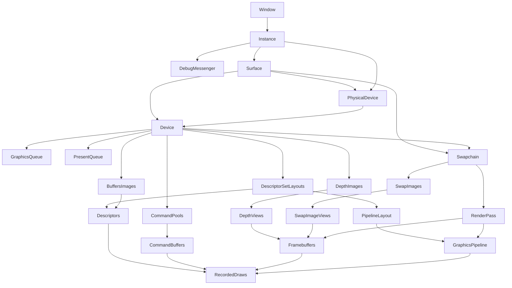

# Vulkan 核心复习讲义：从 API 心智模型到当前渲染器

> 目标不是背创建函数，而是随时回答五个问题：**对象归谁、依赖谁、谁在使用、何时可复用、什么同步证明它已经不用了。**
>
> 项目基线：`RAII_Base@13da101`。当前代码请求 Vulkan 1.3，使用经典 Render Pass 与旧式 `vkQueueSubmit` / `vkCmdPipelineBarrier`；讲义同时说明 Vulkan 1.3/1.4 的现代替代路线。

## 0. 一页总览

Vulkan 把传统图形 API 中由驱动隐式完成的工作，显式交给应用：

- 选择设备与队列，而不是让驱动替你决定。
- 明确创建 Swapchain、Render Target、Pipeline 与 Descriptor 接口。
- Buffer/Image 与 Device Memory 分离创建和绑定。
- 先把命令录入 Command Buffer，再异步提交到 Queue。
- 用 Semaphore、Fence、Barrier 显式建立执行顺序和内存可见性。
- 自己管理对象生命周期、线程外部同步、帧并行与交换链失效。

一帧最核心的因果链：

```text
CPU 等待 Frame Fence[F]
  -> WSI Acquire Image I，并在可用时 signal imageAvailable[F]
  -> CPU 等待上次使用 Image I 的 Fence（若有）
  -> 更新 Frame Data[F]，重录 Command Buffer[F]
  -> Graphics Submit：wait imageAvailable[F]
       执行 Render Pass / Draw
       signal renderFinished[I] 与 inFlightFence[F]
  -> Present：wait renderFinished[I]，呈现 Image I
  -> F 循环前进；下一次 I 仍由 Acquire 决定
```

当前渲染器最值得掌握的资源分组：

| 生命周期/索引 | 当前对象 | 它解决的问题 |
|---|---|---|
| Context/Device | Instance、Surface、PhysicalDevice、Device、Queues | 程序与 Vulkan 实现、窗口系统和 GPU 的连接 |
| Frame Slot `F` | CommandPool/Buffer、Acquire Semaphore、Frame Fence、Camera UBO、Object SSBO、Frame Descriptor Set | CPU/GPU 并行时，何时能复用一套每帧资源 |
| Swapchain Image `I` | Swapchain Image/View、Depth Image/View、Framebuffer、Present Semaphore、`imageInFlight` | 本帧渲染到哪张可呈现图像及其配套资源 |
| Asset/Scene | Mesh Buffer、Texture Image/Sampler、Material Descriptor、Scene/Model hierarchy | 场景内容和长期 GPU 资源 |

---

## 1. Vulkan 的第一性原理

### 1.1 Host 与 Device 是两个异步世界

Host 是 CPU 侧程序；Device 是 Vulkan 逻辑设备所代表的执行环境。`vkQueueSubmit` 返回通常只表示“工作已进入队列”，不表示 GPU 已执行完。官方规范明确把 Queue Submission 设计为尽快返回，工作随后异步开始和完成。

因此：

- CPU 不能因为 Submit 返回就改写 GPU 正在读取的 Buffer。
- CPU 不能因为 Submit 返回就 Reset/Free 正在执行的 Command Buffer。
- 两个 Queue 之间默认无顺序。
- Queue 与 Host 之间默认也无顺序。
- “同一个 Command Buffer 中写在前面”不自动等于后面的访问可见该写入；涉及内存依赖时仍要正确同步。

官方入口：[Fundamentals / Execution Model](https://docs.vulkan.org/spec/latest/chapters/fundamentals.html)。

### 1.2 Vulkan 对象是状态与契约的显式载体

典型对象各自只负责一部分：

- `VkInstance`：应用与 Vulkan Loader/实现的根对象，开启 Instance extensions/layers。
- `VkPhysicalDevice`：可查询但不销毁的物理设备句柄。
- `VkDevice`：从物理设备创建的逻辑设备，启用具体 feature/extension/queue。
- `VkQueue`：异步执行入口。
- `VkBuffer` / `VkImage`：资源形状与用途；不等同于内存本身。
- `VkImageView`：选择 Image 的子资源、格式解释与视图类型。
- `VkDescriptorSet`：把 Shader 声明的资源槽位指向实际 Buffer/Image/Sampler。
- `VkPipelineLayout`：Descriptor Set Layout 序列 + Push Constant ranges，定义 Shader 资源接口。
- `VkPipeline`：大部分图形管线状态的已编译组合。
- `VkCommandBuffer`：待执行命令的记录容器。
- `VkSemaphore` / `VkFence`：跨 Queue/WSI 与 Queue->Host 的完成依赖。

Vulkan 的对象结构多数创建后不可变；“内容可变”与“对象结构可变”要分开。例如 Descriptor Set 可以更新指向的资源，但 Descriptor Set Layout 的 binding 结构创建后不变。

### 1.3 “显式”不等于“所有东西都要手工优化”

正确学习顺序是：

1. 先用 `vkDeviceWaitIdle`、每资源独立分配等简单方案得到正确结果。
2. 用 Validation/RenderDoc 证明理解无误。
3. 根据 Profile 再引入持久映射、批量上传、子分配、Timeline Semaphore、异步队列。

错误的过早优化比保守同步更难排查。Khronos 的 [Common Pitfalls](https://docs.vulkan.org/guide/latest/common_pitfalls.html) 也强调 Vulkan 通常有多种可行解法，没有脱离需求的唯一完美方案。

---

## 2. 对象依赖、所有权与 RAII

### 2.1 当前对象依赖图

箭头 `A --> B` 表示 B 的创建或有效使用依赖 A；销毁通常反向进行。



### 2.2 创建者、所有者、引用者不是一回事

- Swapchain images 由 WSI/Swapchain 提供。应用保存句柄并创建 ImageView，但**不能**对它们调用 `vkDestroyImage`。
- Descriptor Set 从 Descriptor Pool 分配。销毁 Pool 会隐式回收 Sets。
- Command Buffer 从 Command Pool 分配。可显式 Free，也会随 Pool 回收。
- `VkPhysicalDevice` 来自枚举，不由应用销毁。
- Queue 从 Device 获取，不单独销毁。
- `RenderObject` 中的 `Mesh*`/`GpuMaterial*` 是非拥有引用，实际所有权在 `RenderAssetCache`。

### 2.3 当前 RAII 设计的关键模式

当前多数 wrapper 遵循：禁止复制、允许移动、析构调用 `reset()`、`create()` 先在局部构建完整 replacement，成功后再提交到成员。

```cpp
Resource replacement(...); // 任一步失败时局部对象自动清理
reset();                    // 只有 replacement 完整成功才替换旧资源
*this = std::move(replacement);
```

这是“强异常安全保证”的常见实现：失败后旧对象仍保持原状态，或当前对象回到明确的空状态。

### 2.4 声明顺序也是生命周期工具

C++ 成员按声明逆序析构。当前代码把依赖关系编码进声明顺序，例如：

- `SwapchainResources` 中 `images_` 后声明，因此先析构其中的 Framebuffer/Depth/Present Semaphore，再析构 Render Pass 和 Swapchain。
- `RenderAssetCache` 把 Descriptor Pool 最后声明，使它先销毁 Descriptor Sets，再销毁 Sets 引用的 Buffer/ImageView/Sampler。
- `App` 中 `renderer` 在 `vulkanContext` 后声明，因此先析构 Renderer 子资源，后析构 Device。

记忆规则：**父对象要比引用它的子对象活得更久。**

---

## 3. 初始化：Window 到 Device/Queue

当前入口是 `App::initVulkan()`，Context 层位于 `VulkanContext` 和 `Device`。

### 3.1 Window 与 Surface

Window 是平台窗口；`VkSurfaceKHR` 是 Vulkan 与窗口系统的呈现接口。Surface 是 Instance-level 对象，用来查询：

- 某 Queue Family 是否支持向该 Surface Present。
- 支持的 Surface Format、Present Mode、Extent 与 Image 数量限制。

因此选择 PhysicalDevice 时不仅要看“能画图”，还要看“能否向这个 Surface 呈现”。

### 3.2 Instance

`VkApplicationInfo` 中 API version 是应用希望使用的最高核心版本，不是强迫驱动提供该版本。健壮应用应先用 `vkEnumerateInstanceVersion` 查询 Loader 支持，再检查 PhysicalDevice 的 `apiVersion`。当前项目直接请求 `VK_API_VERSION_1_3`。

Instance extensions 与 Device extensions 不在同一层：

- GLFW 返回平台 Surface 所需的 Instance extensions。
- Validation 诊断消息使用 `VK_EXT_debug_utils` Instance extension。
- 呈现 Swapchain 使用 `VK_KHR_swapchain` Device extension。

版本差异见官方 [Vulkan Versions & Porting Guide](https://docs.vulkan.org/guide/latest/versions.html)。

### 3.3 Validation Layer 与 Debug Messenger

Debug 构建开启 `VK_LAYER_KHRONOS_validation`。Layer 位于应用和驱动之间，检查参数、对象生命周期、线程与同步等 Valid Usage；它不是驱动错误处理的替代品，也不应作为 Release 运行依赖。

`VK_EXT_debug_utils` 的创建/销毁函数是扩展入口，因此当前代码通过 `vkGetInstanceProcAddr` 取得函数指针。把 Debug Messenger create info 链到 `VkInstanceCreateInfo::pNext`，还能捕获 Instance 创建/销毁期间的消息。

官方入口：[Validation Overview](https://docs.vulkan.org/guide/latest/validation_overview.html)、[VK_EXT_debug_utils](https://docs.vulkan.org/guide/latest/extensions/VK_EXT_debug_utils.html)。

### 3.4 PhysicalDevice 选择

最低适用条件：

1. 有 Graphics Queue Family。
2. 有对目标 Surface 的 Present Queue Family。
3. 支持必需 Device extensions。
4. Swapchain 至少有一种 Surface Format 与 Present Mode。
5. 若使用具体 features/formats/limits，还必须提前查询并筛选。

当前实现没有启用额外 `VkPhysicalDeviceFeatures`，但依赖 Swapchain 与深度格式支持。

注意：当前 `Device::create()` 的评分给 Integrated 1000、Discrete 500，而且 `preferIntegratedGpu == true` 时反而在 500 分设备上提前退出。这是遗留逻辑错误，复习时不要把它当成正确策略。

### 3.5 LogicalDevice 与 Queue Family

Queue Family 表示能力相似的一组 Queue。当前应用需要 Graphics 和 Present；两者可以是同一个 Family，也可以分开。

- 每个 unique family 只创建一次 `VkDeviceQueueCreateInfo`。
- `vkGetDeviceQueue` 取得的 Queue 由 Device 拥有。
- 同一 Queue 的 Host 访问需要外部同步；不能从多个 CPU 线程无锁同时 Submit。
- 不同 Queue 默认无顺序，必须用 Semaphore 等显式连接。

官方入口：[Queues](https://docs.vulkan.org/guide/latest/queues.html)。

---

## 4. Swapchain 与 WSI

### 4.1 Swapchain 不是“默认帧缓冲”

Vulkan 没有 OpenGL 式默认 Framebuffer。Swapchain 是由呈现系统管理的一组可呈现 Images。应用的循环是 Acquire 一张、渲染、Present 归还。

官方入口：[Swap chain Tutorial](https://docs.vulkan.org/tutorial/latest/03_Drawing_a_triangle/01_Presentation/01_Swap_chain.html)。

### 4.2 创建时四个核心选择

#### Surface Format

当前优先 `VK_FORMAT_B8G8R8A8_SRGB + VK_COLOR_SPACE_SRGB_NONLINEAR_KHR`。SRGB 格式会在颜色附件写出时进行线性到 sRGB 编码；因此 Shader 中是否手动 Gamma 校正必须与目标格式匹配。当前 Fragment Shader 又执行了 `pow(color, 1/2.2)`，而 Swapchain 优先 SRGB，这可能造成双重 Gamma，属于应通过 RenderDoc/色彩测试复核的点。

#### Present Mode

- `FIFO`：规范保证支持，排队到垂直同步，通常不撕裂。
- `MAILBOX`：队列满时用新帧替换旧帧，低延迟但需要更多图像/显存。
- `IMMEDIATE`：立即交给显示，可能撕裂，当前不选。

当前优先 MAILBOX，否则 FIFO。

#### Extent

若 `currentExtent != UINT32_MAX`，平台固定 Extent；否则把 GLFW framebuffer size clamp 到 capabilities 范围。要用 framebuffer 像素尺寸，而不是受 DPI 影响的逻辑窗口尺寸。

#### Image Count

当前请求 `minImageCount + 1`，并尊重非零 `maxImageCount`。实际图像数仍须通过 `vkGetSwapchainImagesKHR` 查询，不能假定等于请求值。

### 4.3 Queue Family Sharing

当前 Graphics/Present family 不同时用 `CONCURRENT`，相同时用 `EXCLUSIVE`。

- `CONCURRENT` 简化所有权，无需 Queue Family ownership transfer，可能牺牲部分性能。
- `EXCLUSIVE` 通常更高效；跨 Family 时要显式转移 Image ownership。

### 4.4 Swapchain Image 与 ImageView

Image 是资源；ImageView 决定如何解释和选择它：view type、format、components、mip/layer/aspect range。FrameBuffer 和 Descriptor 通常绑定的是 ImageView，不是裸 `VkImage`。

### 4.5 Out-of-date 与 Suboptimal

- `VK_ERROR_OUT_OF_DATE_KHR`：Swapchain 与 Surface 不再兼容，不能继续使用，必须重建。
- `VK_SUBOPTIMAL_KHR`：仍可用，但属性已不是最佳，也应安排重建。

当前 Acquire/Present 都处理这两个结果；窗口 resize 还有 0.15 秒防抖，最小化时等待非零 Extent。

---

## 5. Buffer、Image 与 Device Memory

### 5.1 资源与内存分离

非 sparse Buffer/Image 的基本流程：

```text
vkCreateBuffer / vkCreateImage
  -> vkGet*MemoryRequirements
  -> 从 memoryTypeBits 与 required property flags 选择 memory type
  -> vkAllocateMemory
  -> vkBindBufferMemory / vkBindImageMemory
```

Resource 创建后只是带用途、尺寸、格式等信息的对象；在使用前必须绑定满足要求的 Device Memory。绑定在资源生命周期内不可改变。官方入口：[Resource Creation](https://docs.vulkan.org/spec/latest/chapters/resources.html)。

### 5.2 Memory Property 的直觉

- `DEVICE_LOCAL`：设备访问性能目标，离散 GPU 上通常不可直接 Map。
- `HOST_VISIBLE`：Host 可 `vkMapMemory`。
- `HOST_COHERENT`：Host 写入与 Device 可见性不需要显式 Flush/Invalidate；仍然需要正确的执行同步。
- `HOST_CACHED`：Host 读取更友好，常用于 readback。

“Coherent”只解决缓存可见性规则的一部分，不表示 GPU 已经执行完，也不让正在读取的 GPU Buffer 可以被 CPU 任意覆盖。

### 5.3 当前 Staging Upload

Mesh 上传：

```text
CPU Asset data
  -> HOST_VISIBLE | HOST_COHERENT staging Buffer
  -> vkCmdCopyBuffer
  -> DEVICE_LOCAL Vertex/Index Buffer
```

Texture 上传：

```text
CPU RGBA8
  -> staging Buffer
  -> Image: UNDEFINED -> TRANSFER_DST_OPTIMAL
  -> vkCmdCopyBufferToImage
  -> Image: TRANSFER_DST_OPTIMAL -> SHADER_READ_ONLY_OPTIMAL
```

当前 Barrier 的阶段/访问对：

| 过渡 | Source | Destination |
|---|---|---|
| Undefined -> TransferDst | `TOP_OF_PIPE`, 无 src access | `TRANSFER`, `TRANSFER_WRITE` |
| TransferDst -> ShaderRead | `TRANSFER`, `TRANSFER_WRITE` | `FRAGMENT_SHADER`, `SHADER_READ` |

第一个过渡不需要保留旧内容，因此 `oldLayout=UNDEFINED` 合理。第二个过渡同时解决布局和 Transfer 写入对 Fragment 采样的可见性。

### 5.4 当前实现为何正确但不够快

`UploadContext` 每次 Copy 后调用 `vkQueueWaitIdle`，保证 staging 资源返回前已不再使用，逻辑很容易证明；代价是每个资源上传都把 Graphics Queue 串行停住。

演进方向：

1. 一批资源共用一个 staging arena 与一次 Command Buffer。
2. Submit 时带 Fence，等待批次而非整个 Queue。
3. 用 Timeline Semaphore 标记 upload batch 序号。
4. 需要时使用 Transfer Queue，并处理 Queue ownership。
5. 用 VMA 或自建 block allocator 做子分配，避免“一资源一次 `vkAllocateMemory`”。

官方建议：[Memory Allocation / Transfer](https://docs.vulkan.org/guide/latest/memory_allocation.html)。

### 5.5 Image Layout 是子资源状态

Layout 描述某个 Image subresource 为特定访问优化的内部组织与使用约束，不是单纯的枚举标签。Layout 以 aspect/mip/layer 子资源为粒度；转换通常由 Image Memory Barrier 或 Render Pass/Dynamic Rendering 相关规则完成。

---

## 6. Descriptor、Pipeline Layout 与 Shader 数据

### 6.1 四层关系

```text
Shader 中的 set/binding 声明
  <-> VkDescriptorSetLayoutBinding
  -> VkDescriptorSetLayout（一个 set 的结构）
  -> VkPipelineLayout（set 0..N + push constant ranges）
  -> VkDescriptorSet（该结构的一组实际资源绑定）
```

`VkDescriptorPool` 提供分配容量；Pool size 统计的是每种 descriptor type 的 descriptor 数量，`maxSets` 是 Set 数量，两者都要足够。

官方入口：[Descriptor Sets / Pipeline Layouts](https://docs.vulkan.org/spec/latest/chapters/descriptorsets.html)。

### 6.2 当前 set/binding 总表

#### Set 0：Frame Data

| Binding | Vulkan 类型 | HLSL | 更新频率/索引 |
|---:|---|---|---|
| 1 | `UNIFORM_BUFFER` | `cameraBuffer` | Camera snapshot；每个 Frame Slot 一份 |
| 2 | `STORAGE_BUFFER` | `objectData[]` | 当前帧所有 Object；每个 Frame Slot 一份 |

Binding 0 目前预留给 future per-frame constants，没有创建 binding；预留编号本身没问题。

#### Set 1：Material Data

| Binding | Vulkan 类型 | 内容 |
|---:|---|---|
| 0 | `UNIFORM_BUFFER` | baseColor、emissive、metallic、roughness factors |
| 1..5 | `SAMPLED_IMAGE` | baseColor、metallicRoughness、normal、occlusion、emissive images |
| 6..10 | `SAMPLER` | 对应五个 sampler |

当前把 Image 和 Sampler 分成独立 descriptors，而非 `COMBINED_IMAGE_SAMPLER`。两种都合法；分离有利于复用 Sampler，但会占更多 bindings/descriptors。

#### Push Constants

`DrawPushConstants` 是 8 字节：`cameraIndex` + `objectIndex`。当前每 Draw 实际只写 `objectIndex`，`cameraIndex` 保持 0。

Push Constants 适合很小且频繁变化的数据，不需要创建 Buffer 或更新 Descriptor。它们的 range 必须与 Shader stage、offset、size 匹配，并受 `maxPushConstantsSize` 限制。官方入口：[Push Constants](https://docs.vulkan.org/guide/latest/push_constants.html)。

### 6.3 为什么 Camera 用 UBO、Object 用 SSBO、索引用 Push Constants

- Camera 数量少、结构固定、访问一致：UBO 合适。
- Object 是可变长数组，最多 1024 条：SSBO 更自然，容量限制通常也宽松。
- 每 Draw 只需告诉 Shader 选择哪一项：Push Constants 传两个索引，避免每 Draw 创建/更新 Descriptor。

这是一个常见的“低频大块数据放 Buffer，高频小选择放 Push Constants”的分层。

### 6.4 Frame Slot 复制防止覆盖在途数据

`PerFrameBuffer` 为每个 `F` 创建一份 Buffer。CPU 只在 `FrameContext[F].inFlightFence` 已信号后更新 Buffer[F]，所以不会覆盖 GPU 仍在读取的同一副本。

它还用版本号避免重复上传：Camera revision 不变时不重新 stage；每个副本记录已上传的版本，轮到该 `F` 时才补齐。

### 6.5 CPU/HLSL 布局必须逐字节匹配

当前 `RenderData.h` 用 `alignas(16)`、`static_assert(sizeof/offsetof)` 固定布局；HLSL 用 column-major matrix。必须同时核对：

- Matrix 主序与 `mul` 顺序。
- `vec3/float3` 后续字段的对齐与 offset。
- UBO/SSBO 对应的 SPIR-V layout 规则。
- C++ padding 不应靠“看起来一样”猜测。

当前 `CameraGpuData=80B`、`ObjectGpuData=128B`、Push Constants=8B，代码已用静态断言保护关键 offset。

---

## 7. Graphics Pipeline 与 Shader Interface

### 7.1 Pipeline 是状态组合，不是整个渲染器

当前 `GraphicsPipeline` 固定：

- Vertex + Fragment Shader modules。
- Triangle List input assembly。
- Vertex input layout。
- Fill rasterization、Back-face culling、CCW front face。
- 1x MSAA。
- Depth test/write，`LESS`。
- 一个 Color attachment，无 blending。
- 与 Render Pass subpass 0 兼容。
- Viewport/Scissor 为 Dynamic State。

因此 Resize 只改变 Extent 时不需要重建 Pipeline；命令录制时重新设置 Viewport/Scissor 即可。若 Render Pass compatibility（例如 color/depth format）变化，当前实现才重建 Pipeline。

### 7.2 Shader Module 与 SPIR-V

HLSL 先编译为 SPIR-V，`VkShaderModule` 只是 Vulkan 接收 SPIR-V 的对象，不等同于最终 GPU ISA。驱动通常在 Pipeline 创建时完成后续编译/优化。

Pipeline 创建成功后可以销毁 Shader Modules；Pipeline 已经持有所需的编译结果。当前局部 `ShaderModule` RAII 正是这个生命周期。

### 7.3 Vertex Input 映射

当前一个 binding，`stride=sizeof(Vertex)`，input rate 为 per-vertex；四个 locations：

| Location | VkFormat | C++ 字段 | HLSL 输入 |
|---:|---|---|---|
| 0 | `R32G32B32_SFLOAT` | `position` | `float3 position` |
| 1 | `R32G32B32A32_SFLOAT` | `color` | `float4 color` |
| 2 | `R32G32B32_SFLOAT` | `normal` | `float3 normal` |
| 3 | `R32G32_SFLOAT` | `texCoord` | `float2 texCoord` |

Location 匹配比 C++ 字段声明顺序更重要；offset 明确告诉 Vulkan从每个 vertex 的哪个字节读取。

### 7.4 Pipeline Layout 是资源 ABI

当前 Layout 顺序是：Renderer 在调用方提供的 Material set layout 前插入 Frame set layout，因此最终是 set 0=Frame、set 1=Material。Shader、Descriptor Set Layout 与 Pipeline Layout 三者任何一处类型、set、binding、stage 不一致，都违反接口契约。

官方精确定义：[Pipelines](https://docs.vulkan.org/spec/latest/chapters/pipelines.html)、[Shader Interfaces](https://docs.vulkan.org/spec/latest/chapters/interfaces.html)。

---

## 8. Render Pass、Framebuffer 与深度

### 8.1 三个容易混淆的层次

- `VkRenderPass`：描述 attachments、subpasses、load/store、布局与 subpass dependencies，不持有实际 Image。
- `VkFramebuffer`：把一个兼容 Render Pass 与具体 ImageViews、宽高、layers 绑定。
- `VkPipeline`：声明自己将在哪个兼容 Render Pass/subpass 中执行，以及如何生成片元、深度和颜色。

当前每个 Swapchain Image `I` 的 Framebuffer 绑定：

```text
attachment 0 = swapchain color ImageView[I]
attachment 1 = depth ImageView[I]
```

### 8.2 Color Attachment 配置

- `loadOp=CLEAR`：Render Pass 开始时用 clear value 清空。
- `storeOp=STORE`：保留结果供 Present。
- `initialLayout=UNDEFINED`：不保留 Acquire 前的旧像素内容。
- `finalLayout=PRESENT_SRC_KHR`：结束时转换到呈现布局。

### 8.3 Depth Attachment 配置

- 每个 `I` 独占 Depth Image，避免两帧并行写同一深度资源的 WAW hazard。
- `loadOp=CLEAR`，clear depth=1.0。
- `storeOp=DONT_CARE`，当前后续不采样深度，无需把结果写回供以后使用。
- `finalLayout=DEPTH_STENCIL_ATTACHMENT_OPTIMAL`。
- Pipeline 使用 `depthCompareOp=LESS`，更小的深度通过。

项目定义了 `GLM_FORCE_DEPTH_ZERO_TO_ONE`，使 GLM 投影深度范围与 Vulkan 的 0..1 约定一致。还要注意 Vulkan framebuffer 坐标与所用矩阵/viewport 的 Y 方向约定；当前通过实际画面验证，不应机械照搬 OpenGL 的投影修正。

### 8.4 Subpass Dependency 的作用

当前 external -> subpass 0 dependency 覆盖 Color Attachment Output 与 Early Fragment Tests，并声明 Color/Depth writes。它为外部操作到本 Render Pass attachment 使用建立依赖。

但要记住：

- Stage mask 是执行范围。
- Access mask 是内存访问范围。
- 只有 stage 而没有合适 access，可能只有执行依赖而没有所需内存可见性。
- 依赖应尽可能精确；过宽的 `ALL_COMMANDS` 或 Queue Idle 会损失并行性。

官方入口：[Render Pass](https://docs.vulkan.org/spec/latest/chapters/renderpass.html)、[Synchronization](https://docs.vulkan.org/spec/latest/chapters/synchronization.html)。

### 8.5 Dynamic Rendering 是什么关系

Dynamic Rendering 允许在 `vkCmdBeginRendering` 时直接指定 attachments，避免为简单 Pass 预先创建 `VkRenderPass`/`VkFramebuffer`。它在 Vulkan 1.3 成为核心；Vulkan 1.4 进一步把经典 Render Pass 标为被新机制 supersede 的 legacy functionality。

这不表示当前代码错误或必须立刻重写。经典 Render Pass 仍是理解 attachment load/store、layout 与依赖的重要基础，也可能适合某些 subpass/tile-local 设计。对当前单 Subpass 渲染器，Dynamic Rendering 会减少对象与重建耦合，是合理的下一步练习。

---

## 9. Command Pool、Command Buffer 与 Draw

### 9.1 Command Buffer 状态机

简化状态：

```text
Initial -> vkBeginCommandBuffer -> Recording
Recording -> vkEndCommandBuffer -> Executable
Executable -> Queue Submit -> Pending
Pending -> GPU 完成 -> Executable 或 Invalid（ONE_TIME_SUBMIT）
非 Pending -> Reset -> Initial
```

Pending 状态下不能 Reset、Free 或重新录制。当前每个 `FrameContext[F]` 先等待自己的 Fence，再 Reset Command Pool，因此安全。

Command Pool 绑定 Queue Family，并且 Host 访问需要外部同步。每 Frame Slot 一个 Pool 的优点：只有 Fence[F] 信号后才 Reset Pool[F]，资源归属直观；未来多线程录制时可进一步每线程每帧一个 Pool。

官方入口：[Command Buffers](https://docs.vulkan.org/spec/latest/chapters/cmdbuffers.html)。

### 9.2 当前每帧录制顺序

```text
vkBeginCommandBuffer(ONE_TIME_SUBMIT)
  vkCmdBeginRenderPass(framebuffer[I], clear color/depth)
    vkCmdBindPipeline
    vkCmdSetViewport / vkCmdSetScissor
    vkCmdBindDescriptorSets(set 0 = FrameData[F])
    for each RenderObject:
      vkCmdBindVertexBuffers / vkCmdBindIndexBuffer
      vkCmdBindDescriptorSets(set 1 = Material)
      vkCmdPushConstants(objectIndex)
      vkCmdDrawIndexed or vkCmdDraw
  vkCmdEndRenderPass
vkEndCommandBuffer
```

Command Buffer 记录的是命令和对象引用。它不复制 Vertex Buffer、Descriptor 指向的数据或 Framebuffer 内容。因此这些对象和相关内存必须一直有效到 GPU 完成执行。

### 9.3 `vkCmdDrawIndexed` 参数心智模型

```cpp
vkCmdDrawIndexed(
    indexCount,
    instanceCount,
    firstIndex,
    vertexOffset,
    firstInstance);
```

- `firstIndex` 选择 Index Buffer 中的起始 index。
- 读取到的 index 再加 `vertexOffset`，得到 Vertex Buffer 中的 vertex index。
- 当前 submeshes 共享大 Buffer，通过 `firstIndex/indexCount` 切片。
- 非 indexed submesh 使用 `firstVertex/vertexCount` 调 `vkCmdDraw`。

### 9.4 动态录制的代价与收益

当前每帧重录适合动态场景、多 Mesh 与材质切换，逻辑清楚。若 CPU 录制成为瓶颈，可考虑：

- 排序 RenderObjects，减少 Pipeline/Material/Mesh 切换。
- Secondary Command Buffers 与多线程录制。
- Indirect/Multi-Draw Indirect。
- GPU culling 与 GPU-driven command generation。

先 Profile 再做；49 个 Draw 不足以证明需要复杂 GPU-driven 架构。

---

## 10. 同步：整套资料最重要的一章

### 10.1 先问 Hazard，再写同步

两个访问作用于重叠内存，且至少一个是写，可能形成：

- RAW：先写后读；后读要看到前写。
- WAR：先读后写；需要保证读先执行完，通常只需执行依赖。
- WAW：先写后写；要明确写入顺序，必要时还涉及可见性/布局操作。

写同步时依次回答：

1. 前一个访问是什么 stage + access？
2. 后一个访问是什么 stage + access？
3. 是否同一 Queue、跨 Queue、WSI，还是 GPU/Host？
4. 需要执行顺序、内存 availability/visibility，还是 Image layout/ownership transfer？

### 10.2 Fence、Semaphore、Barrier 分工

| 工具 | 典型方向 | 当前用途 | 是否携带内存/执行依赖 |
|---|---|---|---|
| Fence | Queue -> Host | Frame Slot 可复用 | Queue Submit 完成可由 Host 等待 |
| Binary Semaphore | Queue/WSI -> Queue/WSI | Acquire -> Graphics；Graphics -> Present | 建立异步操作间依赖；一次 signal/wait 配对 |
| Timeline Semaphore | Queue/Host 间的单调计数 | 当前未使用 | 可表达多个批次/跨队列进度 |
| Pipeline Barrier | Command stream 内 | Texture layout/copy 可见性 | 精确指定 stage/access/resource/layout |
| Subpass Dependency | Render Pass 边界/子通道 | Attachment 使用 | 与 attachment/subpass 范围关联 |

Fence wait 不会自动把 Fence reset；Binary Semaphore 不手动 reset，而是在合法 signal->wait 配对中消耗状态。

### 10.3 两个索引：`F` 与 `I`

| 索引 | 来源 | 周期 | 代表 |
|---|---|---|---|
| `F=currentFrame` | 应用循环 | 0,1,0,1... | 一套 CPU/GPU Frame Slot |
| `I=imageIndex` | `vkAcquireNextImageKHR` | 不保证固定顺序 | 一张 Swapchain Image |

任何时候都不要假设 `F == I`，也不要假设 Image 按 0,1,2 轮流返回。

按 `F`：

- `CommandPool/CommandBuffer[F]`
- `imageAvailable[F]`
- `inFlightFence[F]`
- `camera/object buffers[F]`
- `frame descriptorSet[F]`

按 `I`：

- Swapchain Image/ImageView[I]
- Depth/ImageView[I]
- Framebuffer[I]
- `renderFinished[I]`
- `imageInFlight[I]`（值是最近占用它的 Frame Fence）

### 10.4 一帧逐步证明

#### 1. `frame.waitUntilReusable()`

Host 等待 `inFlightFence[F]`。证明上次使用 Command Pool/Buffer[F] 与 Frame Data[F] 的 Graphics Submit 已完成，因此这些 Frame Slot 资源可 Reset/改写。

#### 2. `vkAcquireNextImageKHR(... imageAvailable[F], &I)`

取得 `I`。当 WSI 允许后续访问该图像时 signal `imageAvailable[F]`。Acquire 返回并不意味着 CPU 可以忽略这个 Semaphore 直接让 GPU 写图像；真正的 GPU 依赖在 Submit wait 中。

若返回 OUT_OF_DATE，当前代码在 Fence reset 前返回，避免留下永远无法被 Submit signal 的未信号 Fence。

#### 3. `waitUntilImageReusable(I)`

`imageInFlight[I]` 是 CPU 侧记录表，不是新 Fence。它保存“最近一次占用 I 的 Frame Fence”。等待它保证 Framebuffer[I]、Depth[I] 等按图像资源不再被上次 Graphics Submit 使用。

#### 4. `markImageInFlight(I, fence[F])`

把本次对 I 的所有权关联到当前 Frame Fence。以后某个 F' 又 Acquire 到 I，就知道该等谁。

#### 5. 更新 Frame Data[F] 与录制 Commands[F]

第 1 步已证明旧 Submit 完成，因此改写这一副本安全。Command Buffer 将 Framebuffer[I] 与 DescriptorSet[F] 绑定到本次工作。

#### 6. `frame.resetFence()`

紧靠在确定要执行的 Submit 前 reset。如果太早 reset，之后 Acquire/录制失败或提前 return，下一次 Host 将永远等待一个没有 Submit 会 signal 的 Fence。

#### 7. Graphics Submit

```text
wait imageAvailable[F] at COLOR_ATTACHMENT_OUTPUT
  -> execute commandBuffer[F]
  -> signal renderFinished[I]
  -> signal inFlightFence[F]
```

等待阶段选择 `COLOR_ATTACHMENT_OUTPUT`，因为 Swapchain Image 首次被本次命令访问是在 Color Attachment Output；Vertex processing 等不接触它的前置阶段可提前运行。

#### 8. Present

`vkQueuePresentKHR` 等待 `renderFinished[I]`。Present wait semaphore 按 `I` 复用，是因为重新 Acquire 到 I 可作为前一次 Present 对该 Image 及其 wait semaphore 已推进到可安全复用点的依据。只按 F 等 Graphics Fence 不足以证明 Present Engine 已消费该 Semaphore。

官方专题：[Swapchain Semaphore Reuse](https://docs.vulkan.org/guide/latest/swapchain_semaphore_reuse.html)。

#### 9. Frame Slot 前进

`F=(F+1)%framesInFlight`。I 不由应用推进。

### 10.5 常见错误

- “同一 CPU 线程 Submit，所以最多一个 Submit 在途”：错；单线程可快速排队多次异步提交。
- “Queue Submit 返回代表 GPU 完成”：错。
- “Fence wait 后自动 reset”：错。
- “Binary Semaphore 像瞬时事件，晚 wait 会丢”：错；它有受规范约束的 signal/wait 状态。
- “Semaphore 需要手动 reset”：错。
- “同一 Queue 上命令天然有完整内存可见性”：错；执行次序和内存依赖不是一回事。
- “Image layout transition 只是改元数据”：错；它属于需同步的 Image subresource 操作。
- “`TOP_OF_PIPE -> BOTTOM_OF_PIPE` 是万能 Barrier”：错；通常既过宽又不能正确表达内存访问。

### 10.6 Synchronization2

Vulkan 1.3 核心的 Synchronization2 把 stage/access 更紧密地放进 `Vk*MemoryBarrier2`，使用 `vkCmdPipelineBarrier2`、`VkSubmitInfo2`，可读性和可组合性更好。当前旧 API 仍合法，但新代码建议优先学习 Synchronization2。

官方入口：[Synchronization2 Guide](https://docs.vulkan.org/guide/latest/extensions/VK_KHR_synchronization2.html)、[Synchronization Examples](https://docs.vulkan.org/guide/latest/synchronization_examples.html)。

---

## 11. Swapchain 重建

### 11.1 为什么需要重建

窗口 resize、DPI/显示器变化、最小化恢复、Surface 属性变化都可能让 Swapchain out-of-date/suboptimal。

### 11.2 当前重建事务

```text
等待非零 framebuffer extent
  -> vkDeviceWaitIdle
  -> Reset Frame Command Pools（旧命令引用旧 Framebuffer/RenderPass）
  -> 创建 new Swapchain（传 oldSwapchain）
  -> 选择 new Depth Format / 创建 new RenderPass
  -> 为每个 new Image 创建 Depth + View + Framebuffer + Present Semaphore
  -> 全部成功后提交替换，销毁旧 bundle
  -> 若 color/depth format 变化，重建 Graphics Pipeline
  -> 更新 Camera aspect
```

这是“先构建 replacement，成功后 commit”的事务式重建。传 `oldSwapchain` 让实现有机会复用资源；但仍须由应用在安全时机销毁旧 Swapchain 与 dependents。

### 11.3 哪些对象与 Extent/Format 耦合

| 对象 | Extent 变化 | Format 变化 |
|---|---|---|
| Swapchain / ImageViews | 重建 | 重建 |
| Depth Images/Views | 重建 | 重建 |
| Framebuffers | 重建 | 重建 |
| Render Pass | 当前总是重建 | compatibility 可能变化 |
| Pipeline | Viewport/Scissor 动态时可不重建 | Render Pass compatibility 变化时重建 |
| FrameContext[F] | 通常不需要 | 通常不需要 |
| Frame Data[F] | 通常不需要 | 通常不需要 |
| Camera projection | aspect 变化时更新 | 无直接关系 |
| Mesh/Texture/Material | 不需要 | 不需要 |

### 11.4 `vkDeviceWaitIdle` 的取舍

当前做法简单正确，但停住整个 Device。优化路径可以等待相关 Frame Fences、把旧 bundle 放入延迟销毁队列，直到引用它的 submissions 全部完成。没有性能证据前，当前方案适合学习项目。

---

## 12. Scene、Asset 与 Vulkan 资源的边界

虽然本讲义以 Vulkan 为重点，但当前架构最重要的工程变化是把“内容数据”和“GPU API 对象”分开。

```text
GLBLoader（来源格式）
  -> GLB* 中间数据
  -> Importers
  -> AssetManager
       TextureAsset / ShaderAsset / MaterialTemplateAsset
       MaterialAsset / MeshAsset / ModelAsset
  -> RenderAssetCache
       GpuTexture / GpuMaterial / Mesh
  -> SceneRenderExtractor
       Scene hierarchy + Model hierarchy
       -> flat RenderFrame.objects
  -> VulkanRenderer
```

好处：

- Asset 不依赖 Vulkan 句柄，可单独测试导入与验证。
- GPU cache 明确负责 CPU Asset -> Vulkan Resource。
- Scene 不拥有 GPU Buffer；Renderer 不需要理解 GLB 节点格式。
- RenderFrame 是一帧的不可变快照边界，适合未来排序、剔除、多线程提取。

### 12.1 World 与 Normal Matrix

场景层级世界矩阵：`parentWorld * localTransform`。法线不能一般地直接乘 world 的左上 3x3；存在非均匀缩放时应使用 inverse transpose。当前 CPU 计算 `transpose(inverse(world))`，Shader 取 3x3 后变换 normal。

### 12.2 Draw 粒度

当前每个 ModelNode 的每个 Mesh 的每个 Submesh 生成一个 RenderObject，因此一帧 49 个 Submesh 就是约 49 次 Draw。每个 Draw 关联：

- Mesh + submesh range。
- Material Descriptor Set。
- ObjectGpuData 中的 world/normal matrix。
- Camera index（当前为 0）。

---

## 13. 材质、纹理与当前 PBR Shader

### 13.1 glTF Metallic-Roughness 数据路径

- `baseColorFactor * baseColorTexture * vertexColor`
- metallic = factor * metallicRoughness texture 的 B 通道。
- roughness = factor * metallicRoughness texture 的 G 通道。
- occlusion 使用 R 通道。
- emissive texture * emissive factor。

Shader 实现 GGX normal distribution、Schlick-GGX geometry、Schlick Fresnel 与简单点光源/环境光，并做简化 tone mapping。

### 13.2 Vulkan 角度更应关注什么

PBR 公式不是 Vulkan 特有；Vulkan 学习重点是：

- 五张 Image 如何上传、转换到 `SHADER_READ_ONLY_OPTIMAL`、创建 View/Sampler。
- Descriptor Set Layout 与 HLSL bindings 如何一致。
- Material UBO 的 byte layout 如何一致。
- Set 0/Set 1 在 Draw 前如何绑定。
- Texture/Image/Sampler/Descriptor 的生命周期如何由 Cache 和 Pool 保证。

### 13.3 当前实现的已知简化

- Texture 仅上传 mip level 0，没有 mipmap 生成。
- `normalTexture` 声明并绑定，但 Fragment Shader 当前没有采样应用它。
- 没有 tangent-space normal mapping；虽然 Vertex 有 tangent，Pipeline/Shader input 也尚未传 tangent。
- 没有 alpha mode、alpha cutoff、double-sided material 等完整 glTF 行为。
- 五个默认槽都必须有纹理；缺省时用 1x1 白图。
- 当前 shader 手动 Gamma 与 SRGB Swapchain 的组合需要复核，避免双重编码。

---

## 14. 当前代码的完整执行路径

### 14.1 启动与初始化

```text
main
  -> App::run
    -> Window::create
    -> VulkanContext::create
       -> vkCreateInstance
       -> Debug Messenger
       -> Surface
       -> Device::create
          -> enumerate/rank PhysicalDevice
          -> find Graphics/Present Queue Families
          -> vkCreateDevice / vkGetDeviceQueue
    -> App::createDemoAssets
       -> default texture / SPIR-V / material template
       -> GLB load + import -> AssetManager
       -> Scene root
    -> RenderAssetCache::create
       -> material Descriptor layout/pool/sets
       -> texture staging upload -> Image/View/Sampler
       -> material parameter UBO + Descriptor writes
       -> mesh staging upload -> Vertex/Index Buffers
    -> VulkanRenderer::create
       -> FrameDataResources[F]
       -> SwapchainResources[I]
       -> GraphicsPipeline
       -> FrameContext[F]
    -> Camera setup
```

### 14.2 每帧 CPU 准备

```text
poll window events
  -> handle resize request/debounce
  -> Camera::Update
  -> rotate Scene root
  -> SceneRenderExtractor::extract
       scene world transforms
       model world transforms
       one RenderObject per Submesh
  -> VulkanRenderer::render
```

### 14.3 每帧 Vulkan 工作

```text
wait Fence[F]
  -> acquire I
  -> wait imageInFlight[I]
  -> associate I with Fence[F]
  -> stage/sync Camera UBO[F] and Object SSBO[F]
  -> reset Command Pool[F]
  -> record Render Pass and all Draws
  -> reset Fence[F]
  -> Queue Submit
  -> Queue Present
  -> advance F
```

### 14.4 正常清理

应用显式按高层依赖顺序 reset：Renderer -> GPU Asset Cache -> Scene/CPU Assets -> VulkanContext -> Window。各 RAII wrapper 内部再按引用逆序销毁。

重要原则：`vkDestroy*` 只解决对象生命周期，不会自动等待 GPU。销毁在途资源前必须先由 Fence、Queue Idle、Device Idle 或其他已证明的同步保证不再使用。

---

## 15. 当前代码：正确性、性能与现代化清单

### 15.1 已经做对、应保留的设计

- `F` 与 `I` 明确分离。
- Present Semaphore 和 Depth 归属 `I`。
- Command Pool/Buffer、Acquire Semaphore、Frame Fence、Frame Data 归属 `F`。
- Fence 初始为 Signaled，第一帧不死锁。
- Acquire 成功后才 Reset Fence。
- Buffer/Image/Pipeline 等创建有局部失败回滚。
- Swapchain replacement 全部创建成功才 commit。
- Viewport/Scissor 为动态状态，纯 Extent 变化不重建 Pipeline。
- Descriptor Set 0/1 分离 Frame 与 Material 更新域。
- Camera UBO、Object SSBO、Push Constant index 分工合理。
- Debug 构建启用 Validation。

### 15.2 应优先修正的正确性/语义问题

1. **GPU 选择偏好逻辑反转。** Integrated 得分高于 Discrete；`preferIntegratedGpu` 为真时却提前选择 Discrete。
2. **颜色空间可能双重 Gamma。** SRGB Swapchain 通常已经编码，Fragment Shader 又 `pow(1/2.2)`；应统一 HDR/linear -> tone map -> encode 策略。
3. **`vkDeviceWaitIdle` 返回值被忽略。** Device lost 等结果无法上报；析构路径可忽略，但显式操作路径应考虑结果。
4. **部分 Vulkan 查询函数返回值未检查。** 例如部分 Surface/extension enumerate；学习项目能跑，但工程代码应统一处理。
5. **异常发生在 Fence reset 后、Submit 前的恢复。** 当前录制发生在 reset 前，风险较小；但 reset 之后 `vkQueueSubmit` 失败会留下未信号 Fence。Submit 失败通常已是致命路径，仍应在设计中明确 Renderer 不可继续复用。

### 15.3 性能演进顺序

按收益/复杂度建议：

1. 上传批处理，去掉每资源 `vkQueueWaitIdle`。
2. PerFrameBuffer 持久映射，减少 Map/Unmap。
3. 大块 Device Memory 子分配/VMA。
4. RenderObject 按 Pipeline/Material/Mesh 排序，减少绑定。
5. Pipeline Cache 与异步 Pipeline 编译。
6. Mipmap、纹理压缩、各向异性过滤。
7. 只有 CPU Draw/录制确实成为瓶颈时，再做 multi-thread/secondary/indirect/GPU-driven。

### 15.4 Vulkan 1.3+ 现代化路线

- `vkCmdPipelineBarrier2` + `VkSubmitInfo2`：Synchronization2。
- `vkCmdBeginRendering`：Dynamic Rendering，降低简单 Pass 的 RenderPass/Framebuffer 对象耦合。
- Timeline Semaphore：Upload/跨队列进度；但 WSI Acquire/Present 常仍需要 Binary Semaphore，除非使用相应扩展能力。
- Extended Dynamic State：减少 Pipeline 变体。
- Descriptor Indexing/Descriptor Buffer：材质规模扩大后再考虑。

迁移原则：先写出新旧 API 的等价同步表，再替换；不要因为 API 名称更现代就弱化 stage/access/layout 的因果证明。

---

## 16. 调试与验证工作流

### 16.1 第一层：Validation

每次 Vulkan 修改至少验证：

- Core Validation 无 Error。
- Synchronization Validation 无 hazard。
- Object lifetime 无在途销毁/错误父对象。
- Descriptor、Shader interface 无 mismatch。
- 连续 resize、最小化、恢复无死锁。

Khronos 把 Validation 称为开发者的第一道防线；它还支持 GPU-Assisted Validation 与 Shader printf。官方入口：[Development Tools](https://docs.vulkan.org/guide/latest/development_tools.html)。

### 16.2 第二层：RenderDoc

仓库根目录已有一份 `.rdc` 抓帧。检查一帧时按顺序看：

1. Event Browser 中 Acquire 后的 Render Pass 与 Draws。
2. Pipeline State：Vertex layout、cull/front face、depth state、target formats。
3. Mesh Viewer：Vertex/Index 解释是否正确。
4. Descriptor Sets：set 0 的 Camera/Object Buffer，set 1 的 Material/Textures。
5. Push Constants：objectIndex 是否随 Draw 变化。
6. Texture Viewer：Color/Depth attachment、各材质纹理与 mip。
7. Shader debug/反射：SPIR-V resource bindings 与 locations。

### 16.3 第三层：最小实验

- 打印前 30 帧 `(F,I)`，证明它们无固定映射。
- framesInFlight 从 2 改为 1，观察 CPU/GPU overlap 与等待。
- 故意注释 `imageInFlight[I]` wait，用 Sync Validation 观察是否能构造 hazard。
- 故意把 Present Semaphore 改回 `[F]`，对照官方 reuse 文档和 Validation。
- 去掉 Texture 的第二个 layout transition，观察 validation/画面。
- 把 Depth 改为所有 Framebuffer 共用一张，用 Sync Validation 理解 WAW。
- 把 Swapchain 格式与 Shader Gamma 策略做 A/B 图像对比。

故意制造错误只应在临时分支或可回退修改中进行。

---

## 17. 复习时哪些要背，哪些要查

### 17.1 必须形成直觉

- Queue Submit 异步。
- `F != I`。
- Fence 是 Queue -> Host，Semaphore 是异步操作之间，Barrier 是 stage/access/resource/layout 依赖。
- Binary Semaphore 的 signal/wait 配对与 Present reuse 陷阱。
- Buffer/Image 创建后还要查询 requirements、分配并绑定 memory。
- ImageView 是 Image 的解释/子资源视图。
- Descriptor Set Layout / Pipeline Layout / Shader binding 是一个 ABI。
- Command Buffer pending 时不能 reset/改写。
- Descriptor、Buffer、Framebuffer 等被录入命令后必须活到执行完成。
- Swapchain out-of-date 时哪些 dependents 必须重建。
- RAII 的销毁顺序必须服从 Vulkan 依赖和 GPU 完成证明。

### 17.2 应查官方文档，不必死背

- 每个 struct 的全部字段与默认值。
- 所有 format feature/limit。
- 具体 VUID 编号。
- 不常用 extension feature structs 与 `pNext` 链。
- 各平台 Surface extension 名称。
- 复杂 layout transition 的全部合法 stage/access 组合。
- Subpass compatibility、multiview、sparse、external memory 等细则。

有效复习不是背 `sType`，而是知道为什么该对象存在、它依赖什么，以及遇到 VUID 后去 Spec 的哪个章节查。

---

## 18. 官方文档对照表

| 主题 | 官方资料 |
|---|---|
| 基本执行/对象模型 | [Spec: Fundamentals](https://docs.vulkan.org/spec/latest/chapters/fundamentals.html) |
| 版本与 1.0～1.4 | [Guide: Versions](https://docs.vulkan.org/guide/latest/versions.html) |
| Queue | [Guide: Queues](https://docs.vulkan.org/guide/latest/queues.html) |
| Swapchain | [Tutorial: Swap chain](https://docs.vulkan.org/tutorial/latest/03_Drawing_a_triangle/01_Presentation/01_Swap_chain.html) |
| Buffer/Image/View/Layout | [Spec: Resource Creation](https://docs.vulkan.org/spec/latest/chapters/resources.html) |
| Device Memory/Staging | [Guide: Memory Allocation](https://docs.vulkan.org/guide/latest/memory_allocation.html) |
| Descriptor/Pipeline Layout/Push Constants | [Spec: Descriptor Sets](https://docs.vulkan.org/spec/latest/chapters/descriptorsets.html) |
| Push Constants 实践 | [Guide: Push Constants](https://docs.vulkan.org/guide/latest/push_constants.html) |
| Pipeline | [Spec: Pipelines](https://docs.vulkan.org/spec/latest/chapters/pipelines.html) |
| Shader interface | [Spec: Shader Interfaces](https://docs.vulkan.org/spec/latest/chapters/interfaces.html) |
| Render Pass/Framebuffer | [Spec: Render Pass](https://docs.vulkan.org/spec/latest/chapters/renderpass.html) |
| Command Buffer/Pool | [Spec: Command Buffers](https://docs.vulkan.org/spec/latest/chapters/cmdbuffers.html) |
| 同步精确定义 | [Spec: Synchronization](https://docs.vulkan.org/spec/latest/chapters/synchronization.html) |
| 常见同步模板 | [Guide: Synchronization Examples](https://docs.vulkan.org/guide/latest/synchronization_examples.html) |
| Synchronization2 | [Guide: VK_KHR_synchronization2](https://docs.vulkan.org/guide/latest/extensions/VK_KHR_synchronization2.html) |
| Present semaphore 复用 | [Guide: Swapchain Semaphore Reuse](https://docs.vulkan.org/guide/latest/swapchain_semaphore_reuse.html) |
| Validation | [Guide: Validation Overview](https://docs.vulkan.org/guide/latest/validation_overview.html) |
| 调试工具 | [Guide: Development Tools](https://docs.vulkan.org/guide/latest/development_tools.html) |
| 当前发布规范/扩展注册表 | [Vulkan Registry](https://registry.khronos.org/vulkan/) |

当前 Registry 发布的是 Vulkan 1.4 系列规范；项目请求 1.3。核心小版本向后兼容，但使用新功能仍必须正确查询版本、feature 与 extension promotion 状态，不能只因为头文件里存在符号就直接调用。

---

## 19. 最终口述检查表

若能不看代码连续讲清下面内容，说明当前阶段已经真正掌握：

1. 从 Window 到第一帧 Present 的对象创建链与销毁逆序。
2. 为什么 PhysicalDevice、Device、Queue Family、Queue 是四个不同层次。
3. Swapchain Image 为什么不由应用销毁，而 ImageView/Framebuffer 要由应用销毁。
4. Buffer/Image 与 Device Memory 为什么分开，staging copy 在做什么。
5. set 0、set 1 与 Push Constants 在当前 Shader 中的精确映射。
6. Pipeline 固定了哪些状态，哪些状态是动态的，Resize 为什么通常不重建它。
7. Render Pass 与 Framebuffer 的区别，以及每个 `I` 为什么需要独立 Depth。
8. Command Buffer 五态与为什么必须等 Fence[F] 后才能 Reset。
9. 完整画出 Acquire -> Submit -> Present，并解释两个 Semaphores 和 Fence。
10. 解释 `F`/`I`、`imageInFlight[I]`、`renderFinished[I]` 的必要性。
11. 解释一个 RAW 或 WAW hazard，并写出 source/destination stage/access 的思考过程。
12. Swapchain 重建中哪些资源重建、哪些保留、什么同步保证旧资源可销毁。
13. 当前 RAII wrapper 如何实现失败回滚，成员声明顺序为何重要。
14. 从 GLB 到 49 个 Draw 的 CPU Asset -> GPU Resource -> RenderFrame 路径。
15. 当前实现最优先的正确性修正和性能演进各是什么。

